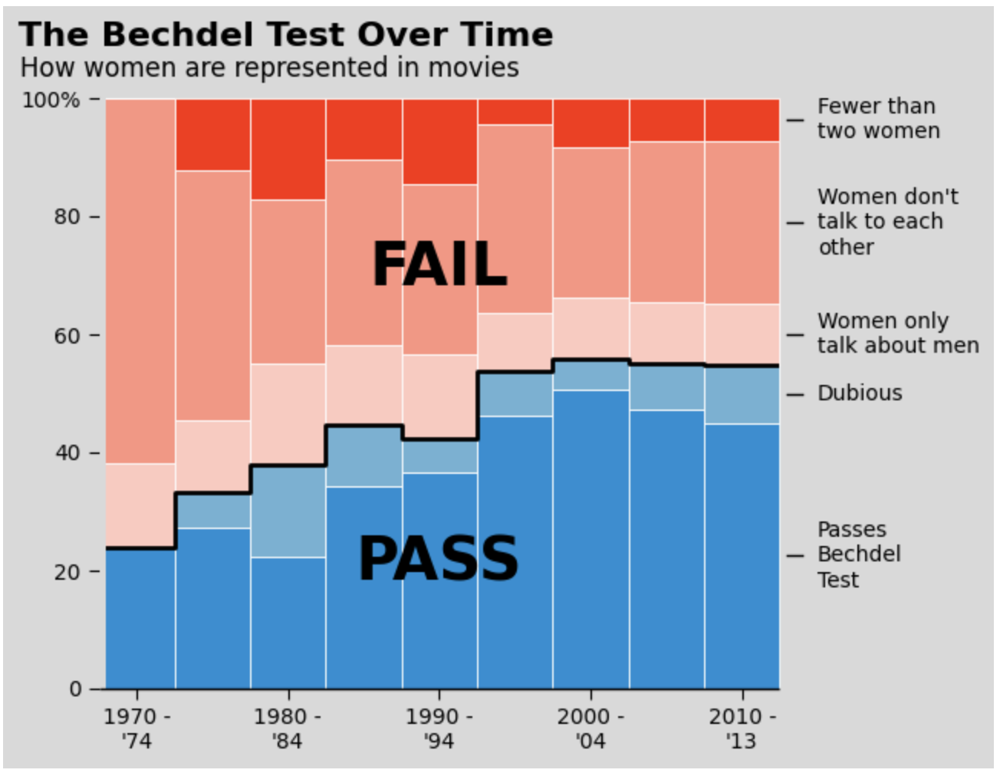

# zihangg.github.io
<!DOCTYPE html>
<html>
<head>
    <title>Zihang Wang - SI-649 Lab 2</title>
    <meta charset="UTF-8">
    <meta name="viewport" content="width=device-width, initial-scale=1">
</head>
<body>
    <h1>Zihang Wang</h1>
    
This is the page for SI-649 Lab 2 Q3.

    <h2>Part 1</h2>
    

    <h2>Part 2</h2>
    
</body>
</html>
